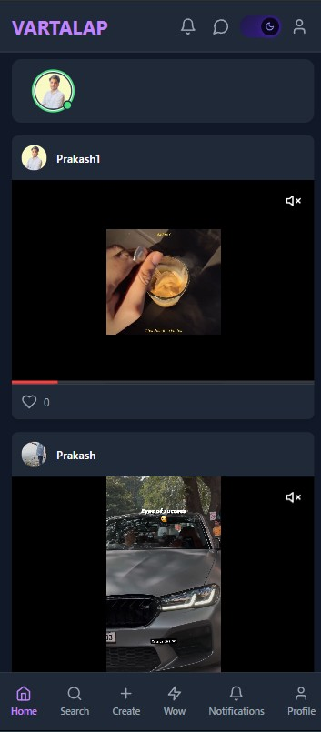
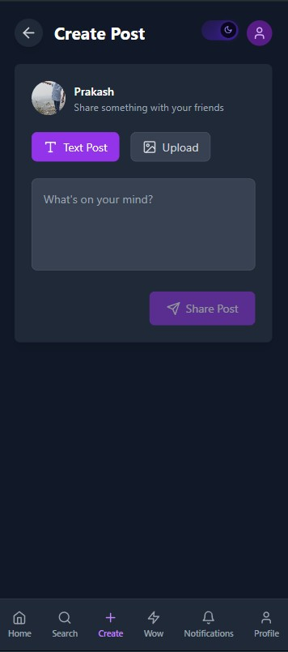
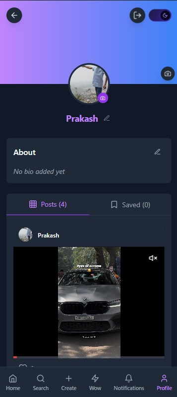
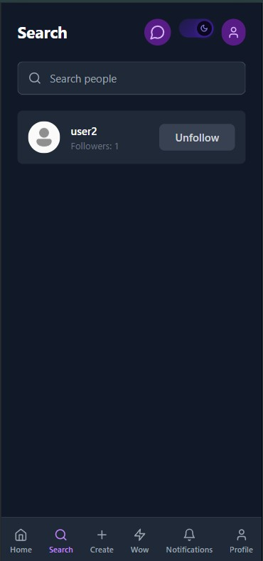

<div align="center">

# VARTALAP — Full-Stack Social Media Platform

**A real-time social networking application built with React, Node.js, MongoDB & Socket.IO**

[](https://vartalap.in.net)
[](https://github.com/PROTOX11/VARTALAP)
[](https://github.com/PROTOX11/VARTALAP/actions)
[](LICENSE)

</div>

---

### 🌐 Experience Vartalap Live: **[vartalap.in.net](https://vartalap.in.net)**

> **Join the platform, create your account, and connect in real-time!**

---

## 🎯 Project Overview

**VARTALAP** (Hindi: "conversation") is a production-grade full-stack social media platform — not a tutorial clone. It features real-time bidirectional messaging, a post feed with interactions, cloud media uploads, JWT authentication, automated CI/CD to a live VPS, and a polished dark-mode UI with View Transition animations.

> Built end-to-end by a solo developer — from database schema design to VPS deployment with PM2 and automated GitHub Actions pipelines.

---

## ✨ Key Features

| Feature               | Details                                                                       |
| --------------------- | ----------------------------------------------------------------------------- |
| 🔐 **Authentication** | JWT-based login/signup with bcrypt hashing, protected routes                  |
| 💬 **Real-time Chat** | Socket.IO bidirectional messaging, typing indicators, online presence         |
| 📸 **Post Feed**      | Create, like, comment on posts with image/video support via Cloudinary        |
| 🔔 **Notifications**  | Real-time alerts for likes, comments, messages                                |
| 🌙 **Dark Mode**      | CSS custom property theming with View Transitions API circular wipe animation |
| 🔍 **User Search**    | Find and follow other users                                                   |
| 📱 **Responsive**     | Mobile-first design, works across all screen sizes                            |
| 🚀 **CI/CD Pipeline** | GitHub Actions → SSH → VPS auto-deploy on every push to `main`                |

---

## 🧰 Tech Stack

<div align="center">

| Layer          | Technology                               |
| -------------- | ---------------------------------------- |
| **Frontend**   | React 18, TypeScript, Vite, Tailwind CSS |
| **Backend**    | Node.js, Express.js                      |
| **Database**   | MongoDB + Mongoose ODM                   |
| **Real-time**  | Socket.IO (WebSockets)                   |
| **Auth**       | JWT + bcrypt                             |
| **Media**      | Cloudinary + Multer                      |
| **Validation** | React Hook Form + Yup                    |
| **State**      | React Context API                        |
| **Deployment** | VPS (Ubuntu), PM2, Nginx                 |
| **CI/CD**      | GitHub Actions                           |

</div>

---

## 🏗️ Architecture

```
VARTALAP/
├── src/                        # React Frontend (Vite + TypeScript)
│   ├── pages/                  # Login, Signup, Dashboard, Chat, Profile...
│   ├── components/             # Reusable UI components (ThemeToggle, PostCard...)
│   ├── contexts/               # AuthContext, ThemeContext, SocketContext
│   └── utils/                  # Form validation schemas
│
├── server/                     # Node.js + Express Backend
│   ├── routes/                 # auth, users, posts, chat, messages, notifications
│   ├── controller/             # Business logic handlers
│   ├── models/                 # Mongoose schemas (User, Post, Chat, Message)
│   ├── middleware/             # JWT auth middleware
│   └── server.js               # Entry point — HTTP + Socket.IO server
│
└── .github/workflows/
    └── deploy-vartalap.yml     # CI/CD: auto-deploy to VPS on push to main
```

---

## 📡 API Reference

### Authentication

| Method | Endpoint             | Description        |
| ------ | -------------------- | ------------------ |
| `POST` | `/api/auth/register` | Register new user  |
| `POST` | `/api/auth/login`    | Login, returns JWT |

### Users

| Method   | Endpoint                  | Description              |
| -------- | ------------------------- | ------------------------ |
| `GET`    | `/api/users/:id`          | Get user profile         |
| `PUT`    | `/api/users/:id`          | Update profile / avatar  |
| `POST`   | `/api/users/follow/:id`   | Follow a user            |
| `DELETE` | `/api/users/unfollow/:id` | Unfollow a user          |
| `GET`    | `/api/users/search`       | Search users by username |

### Posts

| Method   | Endpoint                 | Description                    |
| -------- | ------------------------ | ------------------------------ |
| `GET`    | `/api/posts`             | Get feed posts                 |
| `POST`   | `/api/posts`             | Create post (with image/video) |
| `PUT`    | `/api/posts/:id/like`    | Like / unlike a post           |
| `POST`   | `/api/posts/:id/comment` | Add comment                    |
| `DELETE` | `/api/posts/:id`         | Delete post                    |

### Chat & Messages

| Method | Endpoint               | Description                    |
| ------ | ---------------------- | ------------------------------ |
| `GET`  | `/api/chat`            | Get all chats for current user |
| `POST` | `/api/chat`            | Create or find existing chat   |
| `GET`  | `/api/message/:chatId` | Fetch messages for a chat      |

### Socket.IO Events

| Event            | Direction       | Description                  |
| ---------------- | --------------- | ---------------------------- |
| `join`           | Client → Server | Register user presence       |
| `sendMessage`    | Client → Server | Send a chat message          |
| `receiveMessage` | Server → Client | Deliver message to recipient |
| `typing`         | Client → Server | Typing indicator             |
| `userTyping`     | Server → Client | Notify recipient of typing   |
| `userOnline`     | Server → Client | Broadcast user came online   |
| `userOffline`    | Server → Client | Broadcast user went offline  |

---

## 🚀 CI/CD Pipeline

Every `git push` to `main` automatically:

```
git push origin main
    ↓
GitHub Actions runner (ubuntu-latest)
    ↓ SSH into VPS (vartalap.in.net)
    ↓ git pull origin main
    ↓ npm install
    ↓ npm run build
    ↓ pm2 restart vartalap-backend
    ↓ pm2 restart vartalap-frontend
    ↓ ✅ Live in ~30 seconds
```

Zero manual deployment — everything ships automatically.

---

## ⚙️ Local Development Setup

### Prerequisites

- Node.js v18+
- MongoDB (local or Atlas)
- Cloudinary account

### 1. Clone & Install

```bash
git clone https://github.com/PROTOX11/VARTALAP.git
cd VARTALAP

# Install frontend deps
npm install

# Install backend deps
cd server && npm install
```

### 2. Configure Environment Variables

Create `server/.env`:

```env
PORT=5000
MONGODB_URI=mongodb://localhost:27017/vartalap
JWT_SECRET=your_jwt_secret_here
CLOUDINARY_CLOUD_NAME=your_cloud_name
CLOUDINARY_API_KEY=your_api_key
CLOUDINARY_API_SECRET=your_api_secret
```

Create `.env` in root:

```env
VITE_API_URL=http://localhost:5000
```

### 3. Run

```bash
# Terminal 1 — Backend
cd server && npm run dev

# Terminal 2 — Frontend
npm run dev
```

Open **http://localhost:5173** 🎉

---

## 📸 Screenshots

<div align="center">

<table>
  <tr>
    <td align="center" width="32%">
      <h4>Login</h4>
      
    </td>
    <td align="center" width="32%">
      <h4>Dashboard</h4>
      
    </td>
    <td align="center" width="32%">
      <h4>Create Post</h4>
      
    </td>
  </tr>
  <tr>
    <td align="center" width="32%">
      <h4>Profile</h4>
      
    </td>
    <td align="center" width="32%">
      <h4>Search User</h4>
      
    </td>
    <td width="32%"></td>
  </tr>
</table>

</div>

---

## 💡 Engineering Highlights

Things that go beyond typical tutorial projects:

- **Real-time architecture**: Socket.IO server with in-memory `connectedUsers` Map for O(1) socket lookup by userId — enables direct peer-to-peer message routing without broadcasting
- **JWT middleware**: Every protected route validates tokens server-side; socket connections also authenticate userId before allowing message sends
- **Input validation**: Both client (Yup + React Hook Form) and server (express-validator) validation layers
- **Cloud media pipeline**: Multer handles multipart uploads → Cloudinary stores and optimizes images/videos → URLs stored in MongoDB
- **View Transitions API**: Dark mode toggle triggers `document.startViewTransition()` creating a circular clip-path wipe animation originating from the exact button pixel position
- **Automated CI/CD**: GitHub Actions SSH action deploys to Ubuntu VPS, restarts PM2 processes — zero-downtime push-to-deploy

---

## 👤 Author

**Prakash Kumar**

[](https://github.com/PROTOX11)

---

## 📝 License

This project is licensed under the [MIT License](LICENSE).

---

<div align="center">
  <sub>Built with ❤️ by Prakash Kumar — <i>where every conversation matters</i></sub>
</div>
